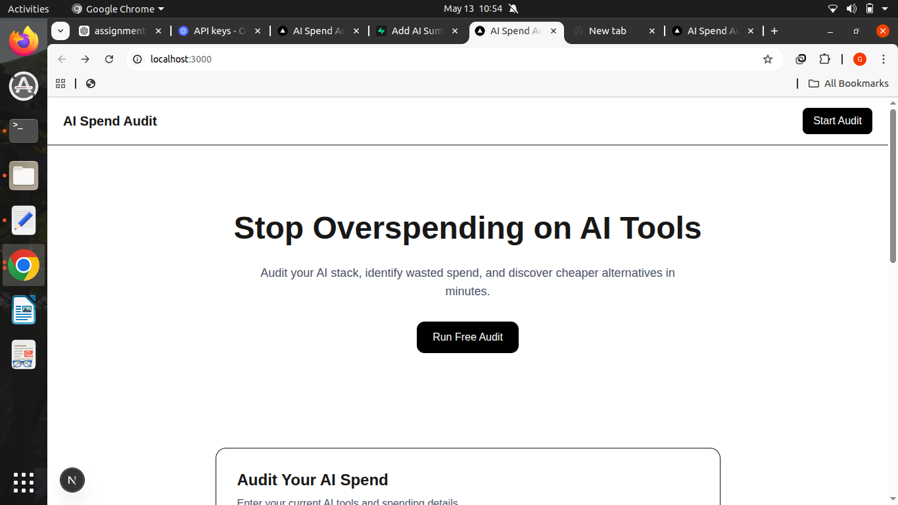
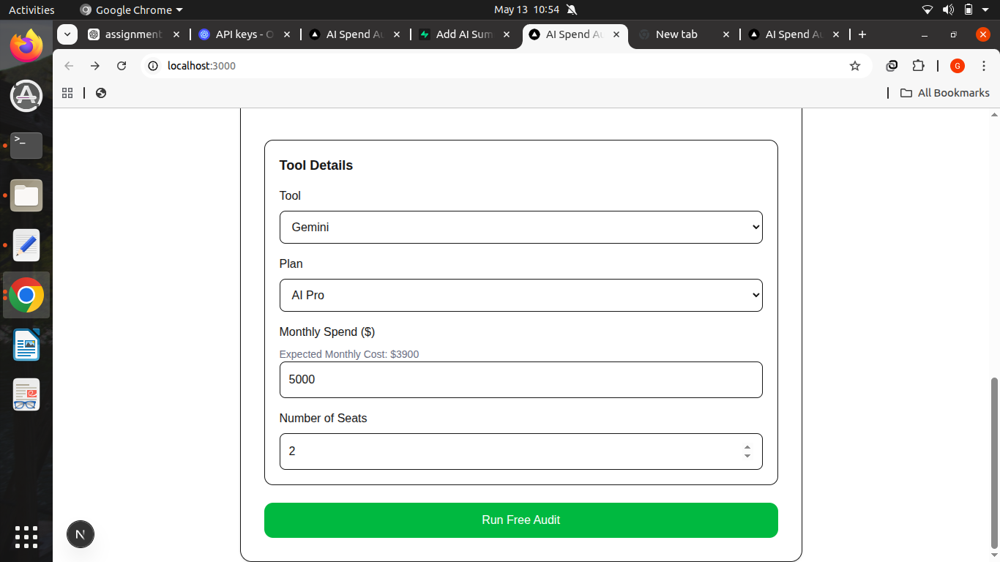
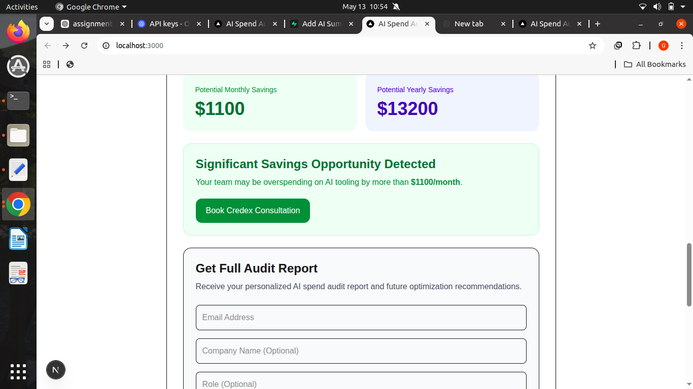
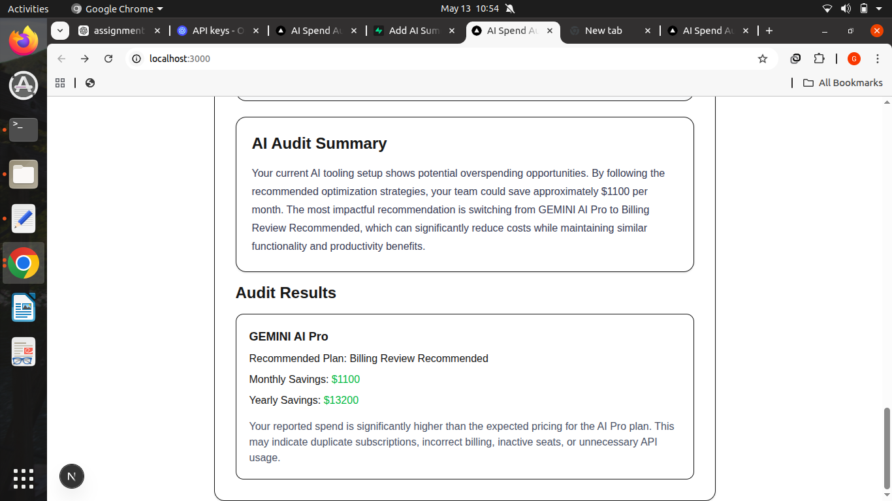
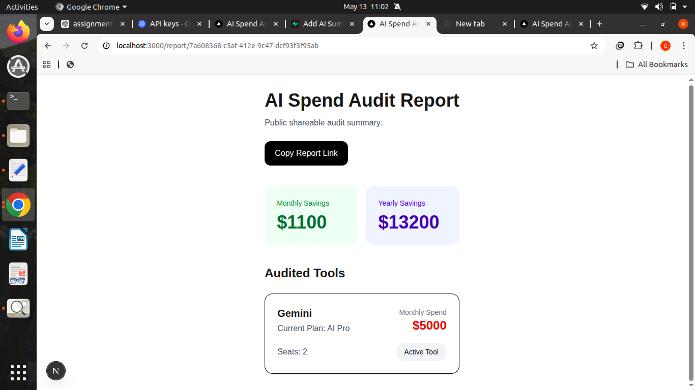

# README.md

# AI Spend Audit

AI Spend Audit is a SaaS-style web application that helps users analyze AI tooling expenses, identify overspending, and discover optimization opportunities.

The platform allows users to:

* audit AI subscriptions,
* compare expected vs actual pricing,
* generate optimization recommendations,
* save audit reports,
* and share public report links.

---

# Live Demo

Production Deployment:
https://ai-spend-audit-peach.vercel.app/

GitHub Repository:
https://github.com/GopikaPamisetty/AI_Spend_Audit

---

# Features

## Audit Engine

* Dynamic AI tool auditing
* Savings calculations
* Overspending detection
* Recommendation generation

---

## Supported Tools

* ChatGPT
* Claude
* Cursor
* GitHub Copilot
* Gemini

---

## Report Generation

* Save audit reports
* Public shareable URLs
* Dynamic report pages

---

## UX Features

* LocalStorage persistence
* Smooth scrolling
* Optimized-state messaging
* High-savings callouts

---

## Engineering Features

* TypeScript
* Automated testing
* GitHub Actions CI/CD
* ESLint validation
* Production deployment

---

# Tech Stack

## Frontend

* Next.js 16
* React 19
* TypeScript
* Tailwind CSS

---

## Backend

* Supabase
* PostgreSQL

---

## Deployment

* Vercel

---

## Testing

* Vitest
* GitHub Actions

---

# Project Structure

```text id="rdm1"
src/
 ├── app/
 ├── components/
 ├── constants/
 ├── lib/
 ├── types/
 └── __tests__/
```

---

# Installation

## Clone Repository

```bash id="rdm2"
git clone https://github.com/GopikaPamisetty/AI_Spend_Audit.git
```

---

## Navigate Into Project

```bash id="rdm3"
cd AI_Spend_Audit
```

---

## Install Dependencies

```bash id="rdm4"
npm install
```

---

# Environment Variables

Create:

```text id="rdm5"
.env.local
```

Add:

```env id="rdm6"
NEXT_PUBLIC_SUPABASE_URL=your_supabase_url
NEXT_PUBLIC_SUPABASE_ANON_KEY=your_supabase_anon_key
```

---

# Run Locally

```bash id="rdm7"
npm run dev
```

Application:

```text id="rdm8"
http://localhost:3000
```

---

# Run Tests

```bash id="rdm9"
npm test
```

---

# Run Lint

```bash id="rdm10"
npm run lint
```

---

# Build Production Version

```bash id="rdm11"
npm run build
```

---

# CI/CD Pipeline

GitHub Actions automatically runs:

* ESLint
* automated tests

on every push to:

```text id="rdm12"
main
```

Pipeline file:

```text id="rdm13"
.github/workflows/ci.yml
```

---

# Key Product Features

## Public Report Sharing

Saved audits generate:

```text id="rdm14"
/report/[id]
```

shareable URLs.

---

## Recommendation Engine

The audit engine detects:

* overspending
* free-plan billing anomalies
* unnecessary upgrades
* inefficient pricing choices

---

## Honeypot Spam Protection

A hidden honeypot field blocks automated spam submissions.

---

# Screenshots

## Landing Page



---

## Audit Form



---

## Results Page


---

## Audit Summary



---

## Public Report Page



---

# Key Decisions & Trade-Offs

## 1. Rule-Based Audit Logic Instead of Full AI Analysis

I intentionally used deterministic rule-based pricing logic for the audit calculations instead of relying fully on LLM outputs. Financial recommendations require predictable and explainable behavior.

---

## 2. Next.js + TypeScript Instead of Plain React

I selected Next.js with TypeScript because it provides better scalability, routing, deployment support, and stronger type safety for a production-style application.

---

## 3. Supabase Instead of Building a Custom Backend

Supabase accelerated backend development significantly while still providing a real PostgreSQL database, authentication support, and deployment-friendly APIs.

---

## 4. Public Shareable Reports Without Authentication

I prioritized frictionless sharing and viral distribution instead of requiring user accounts. This improves usability and supports product-led growth behavior.

---

## 5. Local Summary Generation Instead of Browser-Based OpenAI Calls

I initially experimented with direct OpenAI integration, but browser-side API usage created security and runtime issues. I replaced it with deterministic summary generation for reliability and deployment safety.

---

# Future Improvements

Potential future enhancements:

* AI-generated summaries
* authentication
* dashboards
* PDF exports
* analytics
* billing integrations
* usage-based optimization

---

# Documentation Files

Additional project documentation:

* ARCHITECTURE.md
* TESTS.md
* DEVLOG.md
* REFLECTION.md
* ECONOMICS.md
* GTM.md
* PROMPTS.md
* PRICING_DATA.md
* USER_INTERVIEWS.md
* METRICS.md
* LANDING_COPY.md

---

# Lessons Learned

Key learning areas:

* full-stack engineering
* CI/CD workflows
* Supabase integration
* deployment debugging
* React linting
* TypeScript validation
* SaaS product thinking

---

# Conclusion

AI Spend Audit demonstrates:

* full-stack web development,
* SaaS architecture,
* backend integration,
* CI/CD automation,
* and product-oriented engineering.

The project successfully evolved into a production-deployed AI tooling optimization platform.

